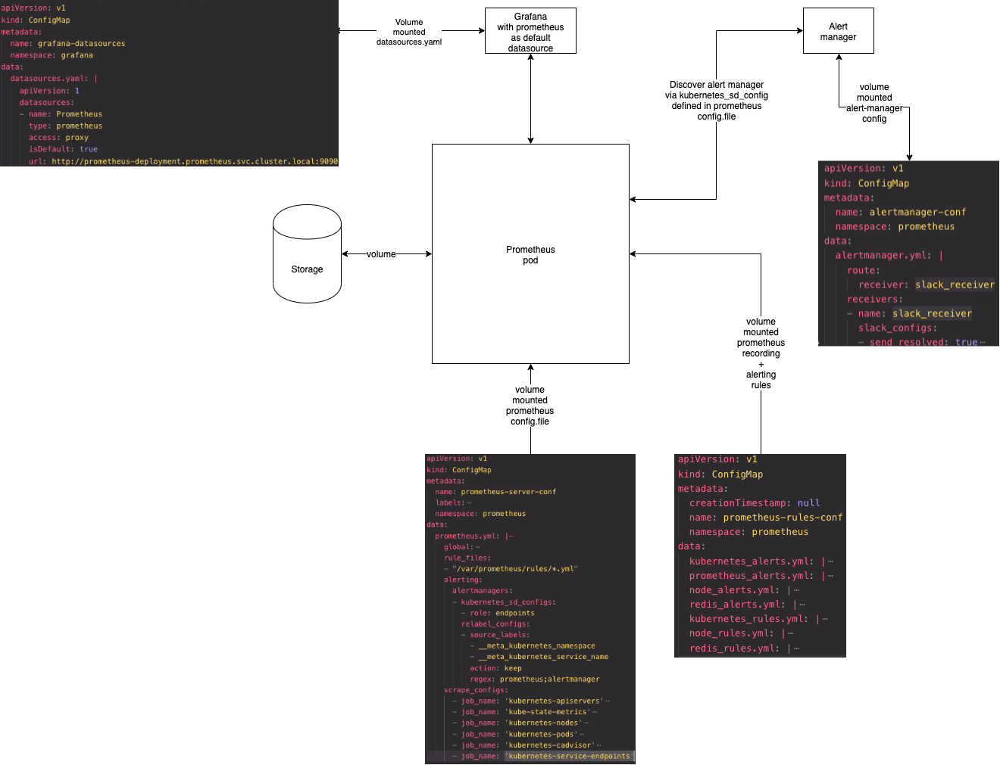

# k8s-prometheus-grafana-alertmanager
Simplest way to configure prometheus, grafana and alert manager with regular k8s manifests ( no operator, no helm charts, good for learning and understanding purposes )

